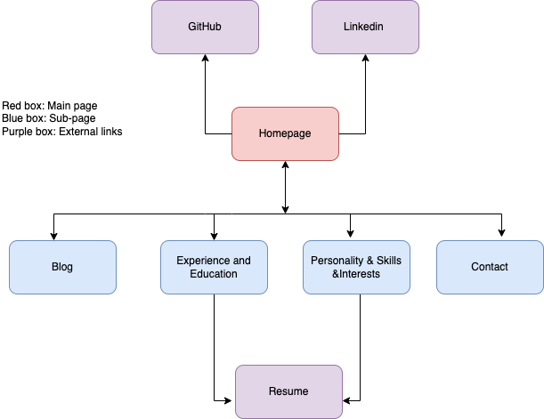

# A link (URL) to your published portfolio website
[My Portfolio Website](http://127.0.0.1:5555/portfolio%20homepage.html)

# A link to your GitHub repo
[My GitHub Portfolio](https://github.com/AnaBondiguel/My-Portfolio.git)

# Description of your portfolio website, including,
### Purpose
My portfolio is designed to provide a platform to show my experience, eduction, and skills, more importantly to demonstrate what I learnt and knew about coding. If someone who looks for software engineers, can check my portfolio and get a sense of my experience and skills very quickly.

### Functionality / features
My portfolio has four web pages including homepage, blog, experience and education, and personality, skills, and interests. Each page has both HTML document and CSS style sheet. 

The key features in general include: 
comments in the CSS and HTML code to identify each component;
semantic HTML elements and attributes (adding meaning and accessibility);
flexbox responsive layout designs: for different types of screens and; on the navigation bar/sidebar/headers (with media queries)

The key features for each webpage
1. Homepage:
Navigation bar for links (with pseudo-class selector a:hover) to all website pages & Sidebars for icon links to professional accounts 
2. Blog Posts:
A list of blog posts with titles and date published (with SVG graphic and text) & A blog with five sample posts and their images
3. Experience and Education:
Content about my experience and education history & A link to a PDF resume
4. Personality, Skills, and Interests:
Content about my experience and education history

### Sitemap

### Screenshots

### Target audience
Employers

### Tech stack (e.g. html, css, deployment platform, etc)
HTML, CSS