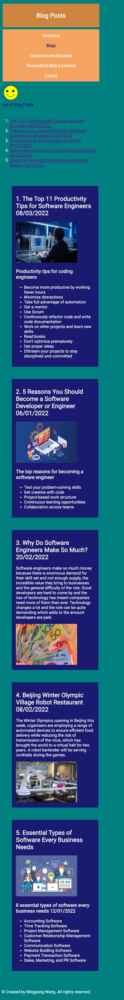
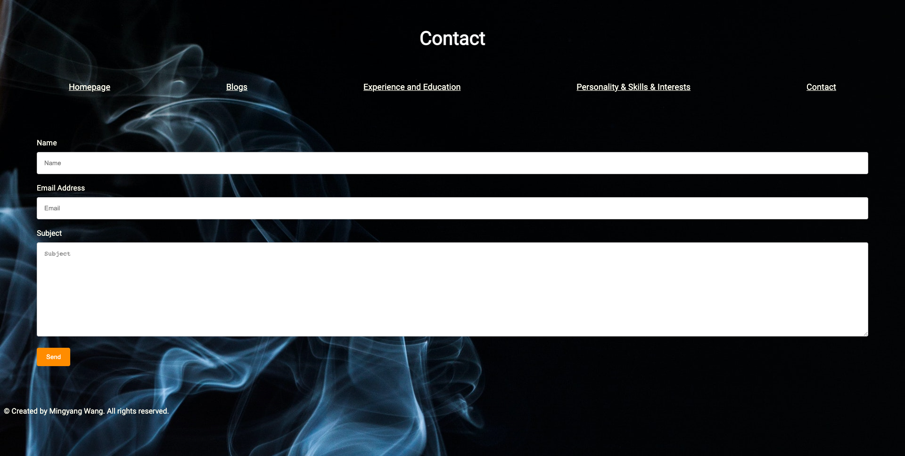
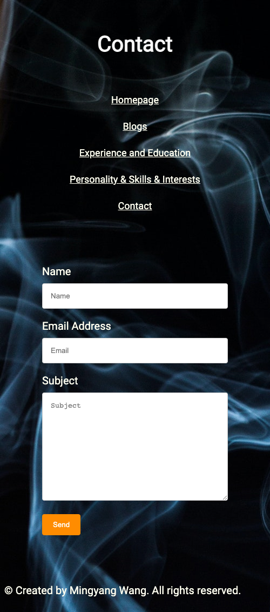

# A link (URL) to your published portfolio website
[My Portfolio Website](https://pensive-tereshkova-b370ee.netlify.app/portfoliohomepage.html)

# A link to your GitHub repo
[My GitHub Portfolio](https://github.com/AnaBondiguel/My-Portfolio.git)

# Description of your portfolio website, including,
### Purpose
My portfolio is designed to provide a platform to show my experience, eduction, and skills, more importantly to demonstrate what I learnt about coding. If someone who looks for software engineers, can check my portfolio and get a sense of my experience and skills very quickly.

### Functionality / features
My portfolio has four web pages including homepage, blog, experience and education, and personality, skills, and interests. Each page has both HTML document and CSS style sheet. 

The key features in general include: 
comments in the CSS and HTML code to identify each component;
semantic HTML elements and attributes (adding meaning and accessibility);
flexbox responsive layout designs: for different types of screens and; on the navigation bar/sidebar/headers (with media queries);
displaying favicons next to the page titles in the browser tabs

The key contents and functions for each webpage
1. Homepage:
Navigation bar for links (with pseudo-class selector a:hover) to all website pages & A heading & A portrait photography & Name & Professional positions & Sidebars for icon links to an email and professional accounts & Website copyright in the footer
2. Blog Posts:
A heading in the header & Navigation bar for links (with pseudo-class selector a:hover) to all website pages & A list of blog posts with titles and date published (with bookmarks and SVG graphic and text) & A blog with five sample posts and their images (with tabindex attributes) & Website copyright in the footer
3. Experience and Education:
A heading in the header & Navigation bar for links (with pseudo-class selector a:hover) to all website pages & A portrait photography with name & Content about my experience and education history (with tabindex attributes) & A link to a PDF resume & Website copyright in the footer
4. Personality, Skills, and Interests:
A heading in the header & Navigation bar for links (with pseudo-class selector a:hover) to all website pages & A portrait photography with name & Content about my personality, skills, and inetrests (with a link to my PDF resume and tabindex attributes) & Website copyright in the footer
5. Contact: 
A heading in the header & Navigation bar for links to all website pages & a form with name, email address, subject, and a “send” button & Website copyright in the footer

### Sitemap

### Screenshots
## A picture of portfolio homepage for desktop screen

## A picture of portfolio homepage for mobile screen

## A picture of blog page for desktop screen

## A picture of blog page for mobile screen

## A picture of experience and education page for desktop screen

## A picture of experience and education page for mobile screen

## A picture of personality & skills & interests page for desktop screen

## A picture of personality & skills & interests page for mobile screen

## A picture of Contact page for desktop screen

## A picture of Contact page for mobile screen

### Target audience
Potential Employers

### Tech stack (e.g. html, css, deployment platform, etc)
HTML, CSS