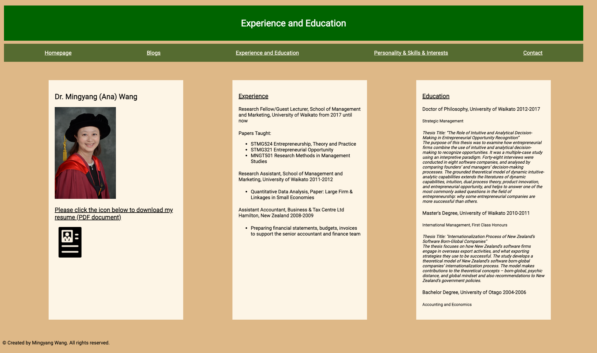
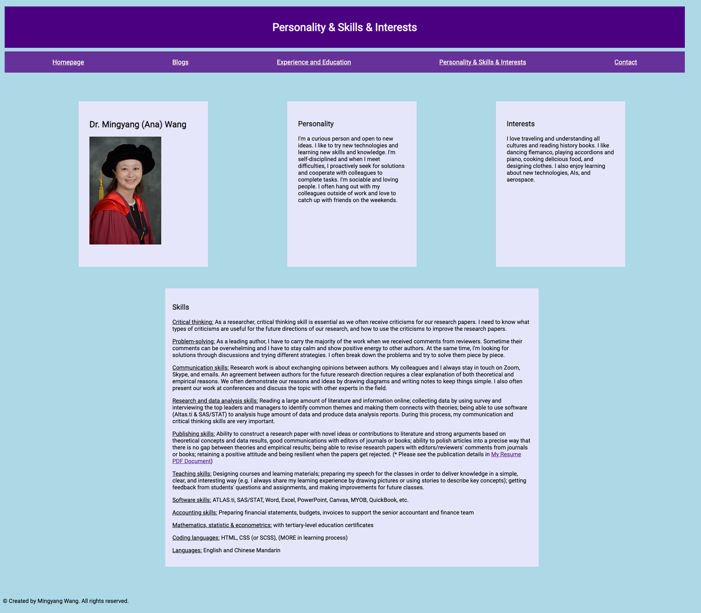

# A link (URL) to your published portfolio website
(http://127.0.0.1:5555/portfolio%20homepage.html)

# A link to your GitHub repo
(https://github.com/AnaBondiguel/My-Portfolio.git)

# Description of your portfolio website, including,
### Purpose
My portfolio is designed to provide a platform to show my experience, eduction, and skills, more importantly to demonstrate what I learnt and knew about coding. If someone who looks for software engineers, can check my portfolio and get a sense of my experience and skills very quickly.

### Functionality / features
My portfolio has four components including homepage, blog, experience and education, and personality, skills, and interests. Each component have both HTML document and CSS style sheet. 
Key features includes links to professional accounts and PDF of the resume, blogs with images, and Flexbox responsive layout designs on the navigation bar, sidebar, and headers.

### Sitemap

### Screenshots

### Target audience
Employers 

### Tech stack (e.g. html, css, deployment platform, etc)
HTML, CSS